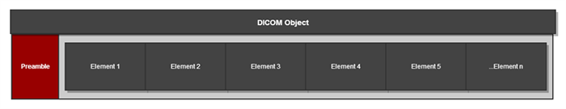

##The Structure of Evil DICOM Core
DICOM and especially DICOM programming can seem overwhelming at first and so let's just get a big picture view of the Evil DICOM library. The cornerstones of the core library are really three classes:

###DICOMObject

The outermost object of a DICOM File is considered the DICOM object, which is encapsulated in the DICOMObject class. The DICOM object is really just a container for the elements. The real meat of a DICOM object are the elements it contains. You will probably want to do a few things with DICOM elements. The DICOMObject class provides a few methods and properties that help with finding and manipulating the DICOM elements.

###AbstractElement

The AbstractElement class is used as a base class for DICOM elements. Elements are the containers of individual pieces of DICOM data that are stored inside of the DICOM object. The elements vary greatly in the type of data that they hold and the AbstractElement class unify and provide access to the similarities of all elements.

###DICOMData

The newest addition to the library is the DICOMData class. It came about because of the flexibility needed for DICOM data. In general DICOM data can have one value, multiple values, or be null. While, an array can potentially capture those needs, I have found it is not as easy to work with as strongly typed properties. The DICOMData class helps meet the needs and flexibility necessary for DICOM data as well as provide a simple interface for accessing and manipulating data.

<!-- API Ad -->
<ins class="adsbygoogle"
     style="display:inline-block;width:728px;height:90px"
     data-ad-client="ca-pub-8634681343664488"
     data-ad-slot="2969171149"></ins>

*<--Please select a class from the left menu to explore the API.*
